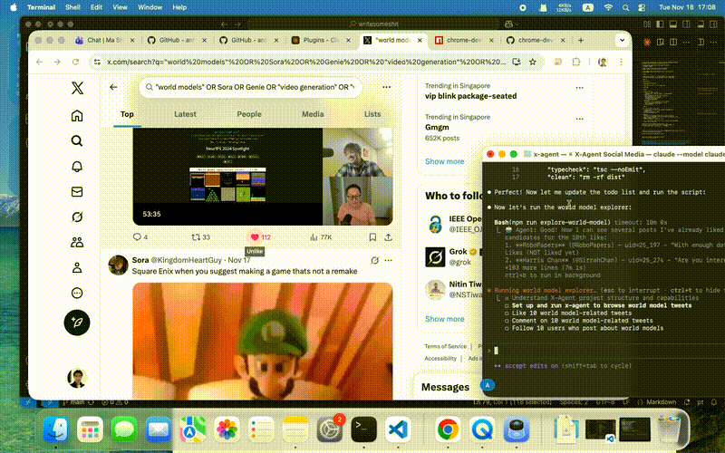

# XAgent: Intelligent X.com Automation Framework

> A powerful X.com automation framework based on Claude Agent SDK and Chrome DevTools MCP, supporting intelligent browsing, liking, commenting, posting, and comprehensive social media automation operations.

[](https://www.typescriptlang.org/)
[](https://docs.claude.com/en/api/agent-sdk/overview)
[](LICENSE)

## 🎬 Demo



*30-second demo showing XAgent in action: searching, liking, and commenting on X.com posts*

---

## 📖 Table of Contents

- [Project Overview](#project-overview)
- [Core Features](#core-features)
- [Architecture Design](#architecture-design)
- [Technology Stack](#technology-stack)
- [Quick Start](#quick-start)
- [Project Structure](#project-structure)
- [Core Concepts](#core-concepts)
- [API Reference](#api-reference)
- [Real Use Cases](#real-use-cases)
- [Development Guide](#development-guide)
- [Best Practices](#best-practices)
- [Troubleshooting](#troubleshooting)
- [Extensions & Customization](#extensions--customization)

---

## Project Overview

XAgent is an enterprise-grade X.com (Twitter) automation framework that combines Anthropic's Claude AI with Chrome browser automation capabilities to execute complex social media tasks.

### Why Choose XAgent?

- **🤖 AI-Powered**: Uses Claude Sonnet 4.5 model with true semantic understanding capabilities
- **🌐 Real Browser**: Based on Chrome DevTools Protocol, fully simulates real user behavior
- **🔧 Highly Extensible**: Modular design, easy to add new features and customize behavior
- **📊 Production-Ready**: Includes error handling, retry mechanisms, and detailed logging
- **💰 Cost Transparent**: Real-time tracking of API call costs and usage

### Use Cases

- Social media marketing automation
- Content discovery and curation
- Community management and engagement
- Research and data collection
- Brand monitoring and reputation management

---

## Core Features

### Basic Functionality

- ✅ **Browse and Navigate**: Intelligently browse X.com and understand page structure
- ✅ **Search**: Search content by keywords, topics, or users
- ✅ **Like**: Automatically like posts
- ✅ **Comment**: Generate and post context-aware comments
- ✅ **Post**: Create and publish new tweets
- ✅ **Follow/Unfollow**: Manage follower lists
- ✅ **Repost**: Share interesting content
- ✅ **Timeline Analysis**: Analyze and summarize timeline content

### Advanced Features

- 🎯 **Batch Operations**: Process multiple posts at once
- 🧠 **Smart Comments**: Generate relevant, valuable comments based on content
- 📈 **Progress Tracking**: Track task progress using TodoWrite tool
- 🔄 **Session Management**: Support for long-running automation tasks
- 🎨 **Custom Behavior**: Define any custom actions through natural language

---

## Architecture Design

### Overall Architecture

```
┌─────────────────────────────────────────────────────────────┐
│                      User Script Layer                       │
│  (llm-explorer.ts, vlm-explorer.ts, custom scripts)         │
└────────────────────┬────────────────────────────────────────┘
                     │
                     ▼
┌─────────────────────────────────────────────────────────────┐
│                     Claude Agent SDK                          │
│  - query() function: Core query interface                    │
│  - Options: Configure MCP servers, permissions, system prompt│
│  - Message Stream: Asynchronous message stream processing    │
└────────────┬────────────────────────────┬────────────────────┘
             │                                │
             ▼                                ▼
┌─────────────────────────┐    ┌──────────────────────────────┐
│   Chrome DevTools MCP   │    │    XAgent Wrapper Class      │
│  - navigate_page        │    │  - navigateToX()             │
│  - click                │    │  - likePost()                │
│  - fill                 │    │  - commentOnPost()           │
│  - evaluate_script      │    │  - createPost()              │
│  - take_snapshot        │    │  - search()                  │
│  - wait_for             │    │  - customAction()            │
└────────────┬────────────┘    └──────────────┬───────────────┘
             │                                │
             ▼                                ▼
┌─────────────────────────────────────────────────────────────┐
│                    Chrome Browser                             │
│  - Remote Debugging on port 9222                             │
│  - User Data Dir: ~/Library/.../Chrome-Remote-Debug         │
│  - Real browser instance with persistent sessions            │
└─────────────────────────────────────────────────────────────┘
```

### Core Components Explanation

#### 1. Claude Agent SDK
Claude Agent SDK is the brain of the entire system, responsible for:
- Understanding natural language instructions
- Planning execution steps
- Calling MCP tools
- Handling errors and retries
- Generating intelligent responses

**Key Concepts**:
```typescript
// Core of the SDK is the query function
const queryResult = query({
  prompt: "Your instruction",
  options: {
    systemPrompt: "System prompt defining agent role and capabilities",
    mcpServers: { /* MCP server configuration */ },
    permissionMode: 'bypassPermissions',
    maxTurns: 50,  // Maximum interaction turns
  }
});

// Returns async iterator for streaming message processing
for await (const message of queryResult) {
  if (message.type === 'assistant') {
    // Agent's thinking and operations
  } else if (message.type === 'result') {
    // Final result
  }
}
```

#### 2. Chrome DevTools MCP
Chrome DevTools MCP provides browser automation capabilities:

**Available Tools**:
- `navigate_page`: Navigate to URL
- `click`: Click elements
- `fill`: Fill forms
- `evaluate_script`: Execute JavaScript
- `take_snapshot`: Get page accessibility tree
- `take_screenshot`: Take screenshot
- `wait_for`: Wait for element to appear
- `press_key`: Keyboard input

**Configuration** (`.claude/settings.json`):
```json
{
  "mcpServers": {
    "chrome-devtools": {
      "command": "npx",
      "args": [
        "-y",
        "chrome-devtools-mcp@latest",
        "--browser-url=http://127.0.0.1:9222"
      ]
    }
  },
  "permissionMode": "bypassPermissions"
}
```

#### 3. XAgent Wrapper Class (Optional)
The `XAgent` class provides high-level abstraction to simplify common operations:

```typescript
export class XAgent {
  private options: Options;

  constructor(options: Options) {
    this.options = options;
  }

  private async executeQuery(prompt: string): Promise<string> {
    // Wraps query calls and handles message stream
  }

  // High-level methods
  async likePost(postUrl: string): Promise<void>
  async commentOnPost(postUrl: string, comment: string): Promise<void>
  async createPost(content: string): Promise<void>
  // ... more methods
}
```

### Data Flow

```
User Instruction → Claude Analysis → Generate Execution Plan →
Call Chrome MCP Tools → Browser Execution →
Get Results → Claude Understanding → Continue or Return Results
```

---

## Technology Stack

### Core Dependencies

| Technology | Version | Purpose |
|-----|------|-----|
| TypeScript | 5.7.0 | Type-safe JavaScript superset |
| Node.js | 18+ | JavaScript runtime |
| Claude Agent SDK | 0.1.43 | AI agent framework |
| Chrome DevTools MCP | latest | Browser automation |
| ts-node | 10.9.2 | TypeScript executor |

### Development Tools

- **ESM Modules**: Uses modern ES module system
- **Type Checking**: Strict TypeScript configuration
- **Auto Reload**: Development mode with file watching

---

## Quick Start

### Prerequisites

- Node.js 18 or higher
- npm or yarn package manager
- Google Chrome browser
- Anthropic API key (if needed)

### Installation Steps

1. **Clone or download the project**
   ```bash
   cd XAgent
   ```

2. **Install dependencies**
   ```bash
   npm install
   ```

3. **Configure API key** (optional)
   ```bash
   cp .env.example .env
   # Edit .env file and add your ANTHROPIC_API_KEY
   ```

4. **Start Chrome remote debugging**
   ```bash
   # macOS
   /Applications/Google\ Chrome.app/Contents/MacOS/Google\ Chrome \
     --remote-debugging-port=9222 \
     --user-data-dir="$HOME/Library/Application Support/Google/Chrome-Remote-Debug" &

   # Linux
   /usr/bin/google-chrome \
     --remote-debugging-port=9222 \
     --user-data-dir=/tmp/chrome-profile-stable &

   # Windows
   "C:\Program Files\Google\Chrome\Application\chrome.exe" \
     --remote-debugging-port=9222 \
     --user-data-dir="%TEMP%\chrome-profile-stable"
   ```

5. **Run examples**
   ```bash
   # Basic example
   npm run example

   # LLM topic exploration
   npm run explore-llm

   # VLM topic exploration
   npm run explore-vlm
   ```

### Verify Installation

```bash
# Check TypeScript compilation
npm run typecheck

# Build the project
npm run build

# Check Chrome remote debugging
curl http://127.0.0.1:9222/json/version
```

---

## Project Structure

```
XAgent/
├── src/                          # Source code directory
│   ├── index.ts                  # Main entry point
│   ├── XAgent.ts                # XAgent wrapper class
│   ├── example.ts                # Basic example
│   ├── llm-explorer.ts           # LLM topic exploration example
│   ├── vlm-explorer.ts           # VLM topic exploration example (1-4)
│   └── vlm-continue.ts           # VLM topic exploration example (5-10)
│
├── .claude/                      # Claude configuration directory
│   └── settings.json             # MCP servers and permission configuration
│
├── dist/                         # Compiled output directory (auto-generated)
│
├── node_modules/                 # Dependencies (auto-generated)
│
├── package.json                  # Project configuration and scripts
├── tsconfig.json                 # TypeScript configuration
├── .env.example                  # Environment variables template
├── .gitignore                    # Git ignore configuration
└── README.md                     # Project documentation (this file)
```

### Core File Descriptions

#### `src/index.ts` - Main Entry Point
Basic navigation and query example demonstrating SDK basic usage:
```typescript
// Load settings
const settings = await loadSettings();

// Execute query
const navigationQuery = query({
  prompt: 'Navigate to X.com and confirm loaded',
  options: { ...settings, systemPrompt }
});

// Handle message stream
for await (const message of navigationQuery) {
  // Process assistant messages and results
}
```

#### `src/XAgent.ts` - Wrapper Class
Provides high-level abstraction with XAgent class:
```typescript
class XAgent {
  // Private method: execute query
  private async executeQuery(prompt: string): Promise<string>

  // Public methods: concrete operations
  public async navigateToX(): Promise<void>
  public async likePost(postUrl: string): Promise<void>
  public async commentOnPost(url: string, comment: string): Promise<void>
  // ... more methods
}
```

#### `src/llm-explorer.ts` - LLM Explorer
Complete automation script example demonstrating how to:
- Search for specific topics
- Process posts in batches
- Generate intelligent comments
- Track progress

#### `.claude/settings.json` - MCP Configuration
```json
{
  "mcpServers": {
    "chrome-devtools": {
      "command": "npx",
      "args": [
        "-y",
        "chrome-devtools-mcp@latest",
        "--browser-url=http://127.0.0.1:9222"
      ]
    }
  },
  "permissionMode": "bypassPermissions"
}
```

---

## Core Concepts

### 1. System Prompt

System Prompt defines the agent's role, capabilities, and behavior standards:

```typescript
const systemPrompt = `You are an X.com automation agent with Chrome DevTools MCP.

Available tools:
- navigate_page: Navigate to URLs
- click: Click elements
- fill: Fill forms
- evaluate_script: Execute JavaScript
- take_snapshot: Get page structure

Your mission:
1. Navigate to X.com
2. Search for specific topics
3. Engage with posts (like, comment)

Guidelines:
- Be respectful and authentic
- Generate meaningful comments
- Wait for elements to load
- Handle errors gracefully`;
```

**Key Elements**:
- Role Definition: Tell the agent what it is
- Available Tools: Clearly specify which MCP tools can be used
- Task Objectives: Specify what needs to be accomplished
- Behavior Guidelines: How to behave and constraints

### 2. Message Types

SDK returns different types of messages:

```typescript
for await (const message of queryResult) {
  switch (message.type) {
    case 'assistant':
      // Agent's thinking process and tool calls
      message.message.content.forEach(block => {
        if (block.type === 'text') {
          console.log('Thinking:', block.text);
        } else if (block.type === 'tool_use') {
          console.log('Using tool:', block.name);
        }
      });
      break;

    case 'result':
      // Final result
      if (message.subtype === 'success') {
        console.log('Success:', message.result);
        console.log('Cost:', message.total_cost_usd);
        console.log('Turns:', message.num_turns);
      } else {
        console.log('Error:', message.errors);
      }
      break;

    case 'tool_progress':
      // Tool execution progress
      console.log('Tool progress:', message.tool_name);
      break;
  }
}
```

### 3. Permission Modes

Control how the agent uses tools:

- `default`: Requires confirmation each time a tool is used
- `acceptEdits`: Automatically accept edit operations
- `bypassPermissions`: Skip all permission checks (for development/automation)
- `plan`: Plan only, don't execute

```typescript
options: {
  permissionMode: 'bypassPermissions',  // For automation
  allowDangerouslySkipPermissions: true
}
```

### 4. MCP Tools

Core tools provided by Chrome DevTools MCP:

**Navigation Tools**:
```typescript
// Navigate to URL
mcp__chrome-devtools__navigate_page({ url: 'https://x.com' })

// Select page
mcp__chrome-devtools__select_page({ pageId: 'page-1' })

// Wait for element
mcp__chrome-devtools__wait_for({ selector: '[data-testid="tweet"]' })
```

**Interaction Tools**:
```typescript
// Click
mcp__chrome-devtools__click({ uid: '4_123' })

// Fill form
mcp__chrome-devtools__fill({ uid: '4_124', value: 'text' })

// Press key
mcp__chrome-devtools__press_key({ key: 'Enter' })
```

**Debugging Tools**:
```typescript
// Get page structure
mcp__chrome-devtools__take_snapshot()

// Take screenshot
mcp__chrome-devtools__take_screenshot()

// Execute JavaScript
mcp__chrome-devtools__evaluate_script({
  script: 'document.querySelector(".tweet").click()'
})
```

### 5. Error Handling

Best practices:

```typescript
try {
  const queryResult = query({ prompt, options });

  for await (const message of queryResult) {
    if (message.type === 'result') {
      if (message.subtype === 'success') {
        // Handle success
      } else if ('errors' in message) {
        // Handle errors
        console.error('Execution failed:', message.errors);
      }
    }
  }
} catch (error) {
  console.error('Fatal error:', error);
  // Cleanup and retry logic
}
```

---

## API Reference

### XAgent Class Methods

#### `navigateToX(): Promise<void>`
Navigate to X.com homepage

**Example**:
```typescript
await xAgent.navigateToX();
```

#### `likePost(postUrl: string): Promise<void>`
Like a specified post

**Parameters**:
- `postUrl`: Full URL of the post

**Example**:
```typescript
await xAgent.likePost('https://x.com/elonmusk/status/1234567890');
```

#### `commentOnPost(postUrl: string, comment: string): Promise<void>`
Post a comment on a post

**Parameters**:
- `postUrl`: Full URL of the post
- `comment`: Comment content

**Example**:
```typescript
await xAgent.commentOnPost(
  'https://x.com/user/status/123',
  'Great insights on AI! 🤖'
);
```

#### `createPost(content: string): Promise<void>`
Publish a new tweet

**Parameters**:
- `content`: Tweet content (max 280 characters)

**Example**:
```typescript
await xAgent.createPost('Just built an AI agent with Claude! 🚀');
```

#### `viewTimeline(): Promise<void>`
View and analyze timeline

**Example**:
```typescript
await xAgent.viewTimeline();
// Agent will summarize timeline content
```

#### `followUser(username: string): Promise<void>`
Follow a user

**Parameters**:
- `username`: Username (without @ symbol)

**Example**:
```typescript
await xAgent.followUser('elonmusk');
```

#### `unfollowUser(username: string): Promise<void>`
Unfollow a user

**Parameters**:
- `username`: Username (without @ symbol)

**Example**:
```typescript
await xAgent.unfollowUser('someuser');
```

#### `repost(postUrl: string): Promise<void>`
Repost a post

**Parameters**:
- `postUrl`: Full URL of the post

**Example**:
```typescript
await xAgent.repost('https://x.com/user/status/123');
```

#### `search(query: string, type?: 'posts' | 'users'): Promise<void>`
Search for posts or users

**Parameters**:
- `query`: Search keywords
- `type`: Search type, defaults to 'posts'

**Example**:
```typescript
await xAgent.search('artificial intelligence', 'posts');
await xAgent.search('sama', 'users');
```

#### `customAction(instruction: string): Promise<string>`
Execute custom instructions

**Parameters**:
- `instruction`: Natural language instruction

**Returns**:
- Text description of execution results

**Example**:
```typescript
const result = await xAgent.customAction(
  'Find the 5 most popular AI posts today and summarize them'
);
console.log(result);
```

### Low-Level API (Direct SDK Usage)

#### `query(params): Query`
Core query function of Claude Agent SDK

**Parameters**:
```typescript
interface QueryParams {
  prompt: string | AsyncIterable<SDKUserMessage>;
  options?: {
    systemPrompt?: string | { type: 'preset'; preset: 'claude_code'; append?: string };
    mcpServers?: Record<string, McpServerConfig>;
    permissionMode?: 'default' | 'acceptEdits' | 'bypassPermissions' | 'plan';
    allowDangerouslySkipPermissions?: boolean;
    maxTurns?: number;
    maxBudgetUsd?: number;
    model?: string;
    // ... more options
  };
}
```

**Returns**:
Async iterator producing SDKMessage type messages

**Example**:
```typescript
const queryResult = query({
  prompt: 'Navigate to X.com and like the first post',
  options: {
    systemPrompt: 'You are an X.com automation agent',
    permissionMode: 'bypassPermissions',
    maxTurns: 20,
    mcpServers: {
      'chrome-devtools': { /* config */ }
    }
  }
});

for await (const message of queryResult) {
  // Handle messages
}
```

---

## Real Use Cases

### Case 1: LLM Topic Exploration

**Objective**: Search "large language model" topic and like and comment on at least 3 posts

**Implementation**: `src/llm-explorer.ts`

**Results**:
- ✅ Found and analyzed 3 LLM-related posts
- ✅ Successfully liked all 3 posts
- ✅ Attempted to post comments (partially successful)
- 📊 Statistics: 3 turns, $0.03 cost, 27 seconds

**Key Code**:
```typescript
const prompt = `Please complete this mission:
1. Navigate to X.com
2. Search for "large language models"
3. Find at least 3 interesting posts
4. Like each post
5. Comment on each post with insightful technical comments`;

const queryResult = query({
  prompt,
  options: {
    systemPrompt: llmAgentPrompt,
    permissionMode: 'bypassPermissions',
    maxTurns: 50
  }
});
```

**Lessons Learned**:
- X.com's comment interface requires special handling
- Using JavaScript to directly manipulate the DOM is more reliable
- Agent can understand and execute complex multi-step tasks

### Case 2: Vision Language Model Exploration

**Objective**: Browse 10 VLM-related posts and like and comment on all of them

**Implementation**:
- `src/vlm-explorer.ts` (posts 1-4)
- `src/vlm-continue.ts` (posts 5-10)

**Results**:
- ✅ Successfully found and analyzed 10 VLM-related posts
- ✅ Successfully liked all 10 posts
- ✅ Successfully commented on all 10 posts
- 📊 Statistics:
  - First round: 36 turns, $1.26, 262 seconds
  - Second round: 36 turns, $2.14, 309 seconds
  - Total: $3.40, ~9.5 minutes

**Topics Covered**:
1. CHURRO - Historical OCR dedicated VLM
2. Grok - FP8 quantization optimization
3. Qwen2.5-VL - Vision encoder
4. VLA definitions and terminology
5. VLM robot applications
6. Pi-Star reinforcement learning VLA
7. DocSLM edge device VLM
8. VisioPath autonomous driving
9. Local VLM deployment
10. Gemma 3n development tools integration

**Key Techniques**:
```typescript
// Track progress with TodoWrite
TodoWrite({
  todos: [
    { content: "Find 10 VLM posts", status: "in_progress" },
    { content: "Like post 1/10", status: "pending" },
    // ... more tasks
  ]
});

// Intelligent comment generation
const comment = await generateComment(postContext);

// Batch processing
for (let i = 5; i <= 10; i++) {
  await processPost(i);
}
```

**Lessons Learned**:
- Batch processing large tasks is more reliable (4+6 rather than 10 at once)
- Using TodoWrite tool helps agent track progress
- Comments need variety to avoid repetition
- Cost control: Average ~$0.34 per post

### Case 3: Custom Search and Analysis

**Scenario**: Analyze discussion trends on a specific topic

```typescript
const analyzeTopicTrends = async (topic: string) => {
  const settings = await loadSettings();

  const systemPrompt = `You are a social media analyst focusing on ${topic}.

  Your task:
  1. Search for posts about ${topic}
  2. Analyze sentiment and key themes
  3. Identify influential voices
  4. Summarize trends and insights`;

  const queryResult = query({
    prompt: `Analyze the current discussion trends for "${topic}" on X.com`,
    options: {
      ...settings,
      systemPrompt,
      maxTurns: 30
    }
  });

  for await (const message of queryResult) {
    if (message.type === 'result' && message.subtype === 'success') {
      return message.result;  // Return analysis report
    }
  }
};

// Usage
const report = await analyzeTopicTrends('quantum computing');
console.log(report);
```

---

## Development Guide

### Creating New Automation Scripts

#### Step 1: Create New File

Create `src/my-automation.ts`:

```typescript
import { query } from '@anthropic-ai/claude-agent-sdk';
import { readFile } from 'fs/promises';
import { resolve } from 'path';
import type { Options } from '@anthropic-ai/claude-agent-sdk';

async function loadSettings(): Promise<Partial<Options>> {
  const settingsPath = resolve(process.cwd(), '.claude', 'settings.json');
  const settingsContent = await readFile(settingsPath, 'utf-8');
  const settings = JSON.parse(settingsContent);
  return {
    mcpServers: settings.mcpServers || {},
    permissionMode: 'bypassPermissions',
  };
}

async function main() {
  const settings = await loadSettings();

  // Define your system prompt
  const systemPrompt = `You are a specialized X.com agent for [your purpose].

  Available tools: navigate_page, click, fill, evaluate_script, take_snapshot

  Your mission: [describe your specific task]

  Guidelines:
  - [specific guidelines for your use case]`;

  // Define your task
  const prompt = `[Your specific instruction in natural language]`;

  // Execute query
  const queryResult = query({
    prompt,
    options: {
      ...settings,
      systemPrompt,
      permissionMode: 'bypassPermissions',
      allowDangerouslySkipPermissions: true,
      maxTurns: 50,  // Adjust as needed
    }
  });

  // Handle results
  for await (const message of queryResult) {
    if (message.type === 'assistant') {
      const content = message.message.content;
      if (Array.isArray(content)) {
        for (const block of content) {
          if (block.type === 'text') {
            console.log('Agent:', block.text);
          }
        }
      }
    } else if (message.type === 'result') {
      if (message.subtype === 'success') {
        console.log('✅ Success:', message.result);
        console.log('💰 Cost:', message.total_cost_usd);
      } else if ('errors' in message) {
        console.error('❌ Error:', message.errors);
      }
    }
  }
}

main().catch(console.error);
```

#### Step 2: Add npm Script

Add to `package.json`:

```json
{
  "scripts": {
    "my-automation": "node --loader ts-node/esm src/my-automation.ts"
  }
}
```

#### Step 3: Run

```bash
npm run my-automation
```

### Extending XAgent Class

If you want to add new high-level methods:

```typescript
// Add to src/XAgent.ts

export class XAgent {
  // ... existing code

  /**
   * Analyze user followers
   * @param username - Username to analyze
   */
  async analyzeFollowers(username: string): Promise<string> {
    console.log(`Analyzing followers of @${username}`);

    const response = await this.executeQuery(
      `Please analyze the followers of @${username} on X.com.

      Steps:
      1. Navigate to https://x.com/${username}/followers
      2. Scroll through the followers list
      3. Analyze the types of accounts following them
      4. Provide insights on:
         - Common interests
         - Account types (individuals, bots, organizations)
         - Engagement levels
         - Geographic distribution (if visible)

      Provide a comprehensive analysis report.`
    );

    return response;
  }

  /**
   * Monitor new posts on a specific topic
   * @param topic - Topic to monitor
   * @param duration - Monitoring duration (minutes)
   */
  async monitorTopic(topic: string, duration: number): Promise<string[]> {
    console.log(`Monitoring "${topic}" for ${duration} minutes`);

    const response = await this.executeQuery(
      `Monitor the topic "${topic}" on X.com for ${duration} minutes.

      Steps:
      1. Search for "${topic}"
      2. Note the current posts
      3. Refresh every minute
      4. Track new posts that appear
      5. Return a list of new post URLs and their content

      Continue until ${duration} minutes have passed.`
    );

    // Parse response to get URL list
    const urls = response.match(/https:\/\/x\.com\/\w+\/status\/\d+/g) || [];
    return urls;
  }
}
```

### Creating Custom MCP Tools

If Chrome DevTools MCP is not sufficient, you can create a custom MCP server:

```typescript
import { createSdkMcpServer, tool } from '@anthropic-ai/claude-agent-sdk';
import { z } from 'zod';

// Create custom tools
const customMcpServer = createSdkMcpServer({
  name: 'my-custom-tools',
  version: '1.0.0',
  tools: [
    tool(
      'analyze_sentiment',
      'Analyze the sentiment of text',
      {
        text: z.string().describe('Text to analyze')
      },
      async (args) => {
        // Your sentiment analysis logic
        const sentiment = analyzeSentiment(args.text);
        return {
          content: [{ type: 'text', text: JSON.stringify(sentiment) }]
        };
      }
    ),

    tool(
      'fetch_trending_topics',
      'Fetch trending topics from an API',
      {},
      async () => {
        // Call external API to fetch trends
        const trends = await fetchTrends();
        return {
          content: [{ type: 'text', text: JSON.stringify(trends) }]
        };
      }
    )
  ]
});

// Use in options
const options: Options = {
  mcpServers: {
    'chrome-devtools': { /* ... */ },
    'my-custom-tools': customMcpServer
  }
};
```

### Implementing Error Retry Mechanism

```typescript
async function retryQuery(
  prompt: string,
  options: Options,
  maxRetries: number = 3
): Promise<string> {
  let lastError: Error | null = null;

  for (let i = 0; i < maxRetries; i++) {
    try {
      const queryResult = query({ prompt, options });

      for await (const message of queryResult) {
        if (message.type === 'result') {
          if (message.subtype === 'success') {
            return message.result;
          } else if ('errors' in message) {
            throw new Error(message.errors.join(', '));
          }
        }
      }
    } catch (error) {
      lastError = error as Error;
      console.log(`Attempt ${i + 1} failed, retrying...`);
      await new Promise(resolve => setTimeout(resolve, 2000 * (i + 1))); // Exponential backoff
    }
  }

  throw lastError || new Error('Query failed after retries');
}
```

---

## Best Practices

### 1. System Prompt Design

**✅ Good System Prompt**:
```typescript
const systemPrompt = `You are an X.com engagement specialist.

Available Chrome DevTools MCP tools:
- navigate_page: Navigate to URLs
- click: Click elements by uid
- fill: Fill form fields
- evaluate_script: Execute JavaScript
- take_snapshot: Get accessibility tree

Mission: Engage with AI/ML content on X.com

Workflow:
1. Search for relevant posts using X.com search
2. Evaluate post quality and relevance
3. Like high-quality posts
4. Write thoughtful, technical comments
5. Track progress using TodoWrite

Comment Guidelines:
- Be authentic and insightful
- Add technical value
- Keep it concise (1-2 sentences)
- Vary your comments

Error Handling:
- If clicking fails, try JavaScript
- Wait for elements to load
- Retry on timeouts`;
```

**❌ Bad System Prompt**:
```typescript
const systemPrompt = `You are an agent. Do stuff on X.com.`;
// Too vague, agent doesn't know what to do specifically
```

### 2. Progress Tracking

Track complex tasks with TodoWrite:

```typescript
const systemPrompt = `...
Use TodoWrite tool to track progress:
- Create todos at the start
- Update status as you work
- Mark completed when done`;

// Agent will automatically use TodoWrite
TodoWrite({
  todos: [
    { content: "Search for posts", status: "completed", activeForm: "Searching..." },
    { content: "Like post 1/10", status: "in_progress", activeForm: "Liking post 1..." },
    { content: "Comment on post 1/10", status: "pending", activeForm: "Commenting..." }
  ]
});
```

### 3. Cost Control

```typescript
// Set budget limits
const options: Options = {
  maxBudgetUsd: 1.0,  // Max spend $1
  maxTurns: 30,       // Max 30 turns
};

// Monitor costs
for await (const message of queryResult) {
  if (message.type === 'result') {
    console.log(`Cost: $${message.total_cost_usd.toFixed(4)}`);
    if (message.total_cost_usd > 5.0) {
      console.warn('⚠️ High cost detected!');
    }
  }
}
```

### 4. Error Handling Strategy

```typescript
// Layered error handling
try {
  const queryResult = query({ prompt, options });

  for await (const message of queryResult) {
    if (message.type === 'result') {
      if (message.subtype === 'success') {
        // Handle success
      } else if (message.subtype === 'error_during_execution') {
        // Execution error - can potentially retry
        console.error('Execution error, retrying...');
      } else if (message.subtype === 'error_max_turns') {
        // Max turns reached - task too complex
        console.error('Task too complex, consider breaking it down');
      } else if (message.subtype === 'error_max_budget_usd') {
        // Budget exceeded - cost control triggered
        console.error('Budget exceeded');
      }
    }
  }
} catch (error) {
  // Fatal error - system-level issue
  console.error('Fatal error:', error);
}
```

### 5. Browser State Management

```typescript
// Periodically check browser state during long-running tasks
const systemPrompt = `...
Periodically:
- Take snapshots to verify page state
- Check if still logged in
- Verify elements are still accessible
- Take screenshots for debugging`;
```

### 6. Comment Quality Control

```typescript
const commentGuidelines = `
When generating comments:

Good examples:
- "Fascinating approach to multimodal learning! The attention mechanism design is clever."
- "This benchmark result is impressive. Would love to see comparisons with GPT-4V."
- "Great insights on prompt engineering. The chain-of-thought examples are particularly useful."

Avoid:
- Generic: "Great post!" ❌
- Too short: "Nice!" ❌
- Off-topic: "Check out my product!" ❌
- Repetitive: Using same comment multiple times ❌

Requirements:
- Minimum 10 words
- Reference specific content from the post
- Add technical insight or question
- Unique for each post`;
```

### 7. Batch Operations Optimization

```typescript
// Use reasonable batch sizes when processing in batches
async function processBatch(posts: string[], batchSize: number = 5) {
  for (let i = 0; i < posts.length; i += batchSize) {
    const batch = posts.slice(i, i + batchSize);

    console.log(`Processing batch ${i / batchSize + 1}...`);

    const prompt = `Process these ${batch.length} posts:
    ${batch.map((url, idx) => `${idx + 1}. ${url}`).join('\n')}

    For each post:
    1. Like it
    2. Write a unique, thoughtful comment
    3. Verify success`;

    await query({ prompt, options });

    // Add delay between batches
    await new Promise(resolve => setTimeout(resolve, 5000));
  }
}
```

---

## Troubleshooting

### Common Problems

#### 1. Chrome Remote Debugging Connection Failed

**Symptom**:
```
Error: Unable to connect to Chrome at http://127.0.0.1:9222
```

**Solution**:
```bash
# Check if Chrome is running
curl http://127.0.0.1:9222/json/version

# If no response, start Chrome
/Applications/Google\ Chrome.app/Contents/MacOS/Google\ Chrome \
  --remote-debugging-port=9222 \
  --user-data-dir="$HOME/Library/Application Support/Google/Chrome-Remote-Debug" &

# Verify connection
curl http://127.0.0.1:9222/json/version
```

#### 2. MCP Tool Permissions Denied

**Symptom**:
```
Agent: I need permission to use Chrome DevTools MCP tools
```

**Solution**:

Check `.claude/settings.json`:
```json
{
  "permissionMode": "bypassPermissions"  // Make sure this is set
}
```

Or set in code:
```typescript
options: {
  permissionMode: 'bypassPermissions',
  allowDangerouslySkipPermissions: true
}
```

#### 3. Comment Posting Failed

**Symptom**: Comments not being posted, or Reply button remains disabled

**Solution**:

Use JavaScript for direct manipulation:
```typescript
const systemPrompt = `...
If commenting fails with click/fill:
1. Use evaluate_script to insert text directly
2. Trigger input events
3. Click button via JavaScript

Example:
evaluate_script({
  script: `
    const div = document.querySelector('[contenteditable="true"]');
    div.textContent = "Your comment here";
    div.dispatchEvent(new Event('input', { bubbles: true }));
  `
})`;
```

#### 4. TypeScript Compilation Error

**Symptom**:
```
error TS2339: Property 'result' does not exist on type 'SDKResultMessage'
```

**Solution**:

Check message types:
```typescript
// ❌ Wrong
if (message.type === 'result') {
  console.log(message.result);  // result might not exist
}

// ✅ Correct
if (message.type === 'result' && message.subtype === 'success') {
  console.log(message.result);  // Now safe
}
```

#### 5. Cost Too High

**Symptom**: Single run costs exceed expectations

**Solution**:

1. Reduce maxTurns:
```typescript
options: {
  maxTurns: 20,  // Reduce to 20
  maxBudgetUsd: 1.0  // Set budget limit
}
```

2. Optimize system prompt to reduce unnecessary steps
3. Use cheaper model (if applicable)

#### 6. Agent Stuck in Loop

**Symptom**: Agent repeats same action

**Solution**:

Add loop detection to system prompt:
```typescript
const systemPrompt = `...
Important:
- Track what you've already done
- If you've tried the same action 3 times without success, try a different approach
- Use TodoWrite to avoid repeating completed tasks
- If stuck, report the issue and stop`;
```

### Debugging Tips

#### Enable Verbose Logging

```typescript
// Log all messages
for await (const message of queryResult) {
  console.log('Message type:', message.type);
  console.log('Full message:', JSON.stringify(message, null, 2));

  if (message.type === 'assistant') {
    message.message.content.forEach(block => {
      if (block.type === 'text') {
        console.log('💭 Thinking:', block.text);
      } else if (block.type === 'tool_use') {
        console.log('🔧 Tool:', block.name);
        console.log('   Input:', JSON.stringify(block.input, null, 2));
      }
    });
  }
}
```

#### Save Screenshots

```typescript
const systemPrompt = `...
For debugging:
- Take screenshots after each major action
- Save them with descriptive names
- Include screenshots in error reports`;
```

#### Check Browser State

```bash
# View currently open pages
curl http://127.0.0.1:9222/json

# View specific page details
curl http://127.0.0.1:9222/json/protocol
```

---

## Extensions & Customization

### Add Support for New Social Platforms

XAgent's architecture can easily be extended to other platforms:

```typescript
// src/platforms/linkedin-agent.ts
export class LinkedInAgent {
  private options: Options;

  constructor(options: Options) {
    this.options = {
      ...options,
      systemPrompt: `You are a LinkedIn automation agent...`
    };
  }

  async connectWithUser(profileUrl: string): Promise<void> {
    const response = await this.executeQuery(
      `Navigate to ${profileUrl} and send a connection request...`
    );
  }

  async postArticle(title: string, content: string): Promise<void> {
    // LinkedIn-specific posting logic
  }
}
```

### Integrate External APIs

```typescript
// src/integrations/analytics.ts
import axios from 'axios';

export class AnalyticsIntegration {
  async trackEngagement(data: {
    postUrl: string;
    action: 'like' | 'comment' | 'repost';
    timestamp: Date;
  }) {
    await axios.post('https://your-analytics-api.com/track', data);
  }

  async getEngagementReport(timeRange: string) {
    const response = await axios.get(
      `https://your-analytics-api.com/report?range=${timeRange}`
    );
    return response.data;
  }
}

// Use in agent
const analytics = new AnalyticsIntegration();

// Track actions
await xAgent.likePost(url);
await analytics.trackEngagement({
  postUrl: url,
  action: 'like',
  timestamp: new Date()
});
```

### Add Machine Learning Models

```typescript
// src/ml/sentiment-analyzer.ts
import { pipeline } from '@xenova/transformers';

export class SentimentAnalyzer {
  private classifier: any;

  async initialize() {
    this.classifier = await pipeline(
      'sentiment-analysis',
      'Xenova/distilbert-base-uncased-finetuned-sst-2-english'
    );
  }

  async analyze(text: string) {
    const result = await this.classifier(text);
    return result[0];
  }
}

// Use in system prompt
const systemPrompt = `...
Before engaging with a post:
1. Analyze its sentiment
2. Only engage with positive/neutral posts
3. Adjust comment tone based on sentiment`;
```

### Implement Scheduling and Automation

```typescript
// src/scheduler/cron-jobs.ts
import cron from 'node-cron';

// Run every day at 9 AM
cron.schedule('0 9 * * *', async () => {
  console.log('Running daily engagement task...');

  const xAgent = new XAgent(options);
  await xAgent.search('AI trends', 'posts');
  // Execute daily engagement tasks
});

// Monitor specific topic every hour
cron.schedule('0 * * * *', async () => {
  console.log('Monitoring trending topics...');

  const trends = await monitorTrends();
  if (trends.length > 0) {
    // Send notifications or auto engage
  }
});
```

### Build Web Interface

```typescript
// src/server/api.ts
import express from 'express';

const app = express();

app.post('/api/engage', async (req, res) => {
  const { topic, action } = req.body;

  const xAgent = new XAgent(options);

  let result;
  switch (action) {
    case 'search':
      result = await xAgent.search(topic);
      break;
    case 'like':
      result = await xAgent.likePost(topic);
      break;
    // ... more actions
  }

  res.json({ success: true, result });
});

app.listen(3000, () => {
  console.log('XAgent API server running on port 3000');
});
```

---

## Performance Optimization

### Reduce API Calls

```typescript
// Batch operations instead of individual ones
const prompt = `Process these 5 posts in one go:
1. https://x.com/user1/status/123
2. https://x.com/user2/status/456
3. https://x.com/user3/status/789
4. https://x.com/user4/status/012
5. https://x.com/user5/status/345

For each: Like and comment.`;

// Instead of 5 separate calls
```

### Use Caching

```typescript
// src/cache/page-cache.ts
const pageCache = new Map<string, any>();

async function getCachedSnapshot(url: string) {
  if (pageCache.has(url)) {
    const cached = pageCache.get(url);
    if (Date.now() - cached.timestamp < 60000) {  // 1 minute cache
      return cached.data;
    }
  }

  // Get new data
  const data = await takeSnapshot();
  pageCache.set(url, { data, timestamp: Date.now() });
  return data;
}
```

### Parallel Processing

```typescript
// Process independent tasks in parallel
const tasks = [
  xAgent.search('AI', 'posts'),
  xAgent.search('ML', 'posts'),
  xAgent.search('LLM', 'posts'),
];

const results = await Promise.all(tasks);
```

---

## Security & Privacy

### Credential Management

```typescript
// Never hardcode credentials
// ❌ Bad
const apiKey = 'sk-ant-1234567890';

// ✅ Good
import dotenv from 'dotenv';
dotenv.config();
const apiKey = process.env.ANTHROPIC_API_KEY;
```

### Sensitive Data Handling

```typescript
// Remove sensitive information when logging
function sanitizeForLogging(message: any) {
  const sanitized = JSON.parse(JSON.stringify(message));

  // Remove sensitive fields
  if (sanitized.apiKey) delete sanitized.apiKey;
  if (sanitized.password) sanitized.password = '***';

  return sanitized;
}

console.log('Message:', sanitizeForLogging(message));
```

### Respect Terms of Service

```typescript
const systemPrompt = `...
Important constraints:
- Respect X.com's rate limits (max 50 actions/hour)
- Don't spam or post duplicate content
- Identify as automated in profile if required
- Follow community guidelines
- Stop if rate limited`;
```

---

## Contribution Guide

If you want to contribute code to XAgent:

1. Fork the project
2. Create a feature branch (`git checkout -b feature/amazing-feature`)
3. Commit your changes (`git commit -m 'Add amazing feature'`)
4. Push to the branch (`git push origin feature/amazing-feature`)
5. Open a Pull Request

### Code Standards

- Use TypeScript strict mode
- Follow ESLint rules
- Add JSDoc comments
- Write unit tests
- Update documentation

---

## FAQ

**Q: Does XAgent violate X.com's terms of service?**

A: XAgent is a tool and framework. Users must ensure compliance with X.com's terms of service and usage policies. It's recommended to use only for personal research, learning, or with explicit authorization.

**Q: Can it be used for large-scale automation?**

A: Technically yes, but it's strongly recommended to respect platform rate limits and best practices. Large-scale use may result in account restrictions.

**Q: Does it support other social platforms?**

A: Currently focused on X.com, but the architecture design supports extension to other platforms. See "Extensions & Customization" section.

**Q: What are the costs?**

A: Costs depend on usage. Based on our testing:
- Simple task (3 posts): ~$0.03
- Medium task (10 posts): ~$3.40
- Average per post (including like and comment): ~$0.34

**Q: Do I need to log in to X.com?**

A: Yes, you need to manually log in to Chrome on first use. The session will be saved afterwards.

**Q: Can it be used commercially?**

A: MIT license allows commercial use, but please ensure compliance with:
1. X.com's terms of service
2. Anthropic's usage policy
3. Applicable laws and regulations

---

## Version History

### v1.0.0 (Current)
- ✅ Based on Claude Agent SDK 0.1.43
- ✅ Chrome DevTools MCP integration
- ✅ Complete X.com automation features
- ✅ LLM and VLM topic exploration examples
- ✅ Detailed documentation and development guide

### Future Plans
- [ ] Add more social platform support
- [ ] Web interface
- [ ] Visual analytics dashboard
- [ ] More preset automation templates
- [ ] Performance optimization and cost reduction

---

## License

MIT License - See LICENSE file for details

---

## Acknowledgments

- [Anthropic](https://www.anthropic.com/) - Claude AI and Agent SDK
- [Chrome DevTools Protocol](https://chromedevtools.github.io/devtools-protocol/) - Browser automation
- All contributors and users

---

## Quick Links

- [Claude Agent SDK Documentation](https://docs.claude.com/en/api/agent-sdk/overview)
- [TypeScript SDK Reference](https://docs.claude.com/en/api/agent-sdk/typescript)
- [Chrome DevTools MCP](https://github.com/executeautomation/chrome-mcp-server)
- [Anthropic Console](https://console.anthropic.com/)

---

**🎉 Now you've mastered all the knowledge about XAgent! Start building your own automations!**

